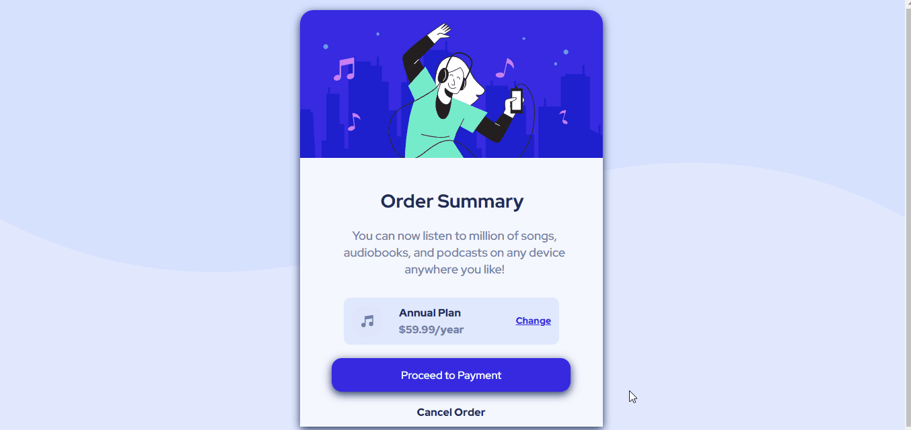

# chalenge-front-end-mentor-order-primary

Este é um desafio do frontend mentor, onde podemos treinar um pouco o flex.

#   chalenge-front-end-mentor-order-primary - Frontend Mentor

## Descrição:
    Bem-vindo! 👋
    Obrigado por conferir a minha resolução do desafio de nível novato do Frontend Mentor, onde vamos criar um pequeno card. Onde vamos treina grid para colocar os itens alinhados.
    

## Técnologias Utilizadas:
    HTML 5
    CSS 3
    Flex
   
